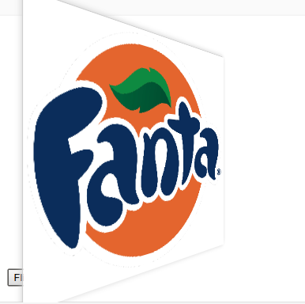

[](https://libraries.io/bower/flip-element)
[](https://github.com/IngressoRapidoWebComponents/flip-element/issues)
[](https://github.com/IngressoRapidoWebComponents/flip-element/blob/master/LICENSE)


# \<flip-element\>

A Polymer web component for Adobe Creative
_[Demo and API docs](https://ingressorapidowebcomponents.github.io/components/flip-element)_

The `flip-element` allows you to add two children nodes, one should have a `front` attribute and the other should have a `back` attribute.
After this just call the `flip` when you want, so you will have a great animation!

 

It's important to define the same size to front and back children node, like this:

```html
    <flip-element id="example">
      <div back style="width: 360px; height: 300px;">
        <iframe width="360" height="300" src="https://www.youtube.com/embed/c6SMZAOwrQQ" frameborder="0" allowfullscreen>
        </iframe>
      </div>
      
    </flip-element>
```

After that, create an editor:
```js
    this.$.example.flip();
```